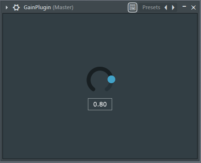

# made-with-juce
This repository contains different VST plugins for DAW softwares.

# 01. Gain Plugin:

    - VST, VST3 Compatible.
    - Parameters can be controlled by automation clips if host supports.
    - Parameter value saved when host saves project.

## Interface:
</img>

## Controlled by an automation clip:
</img>

